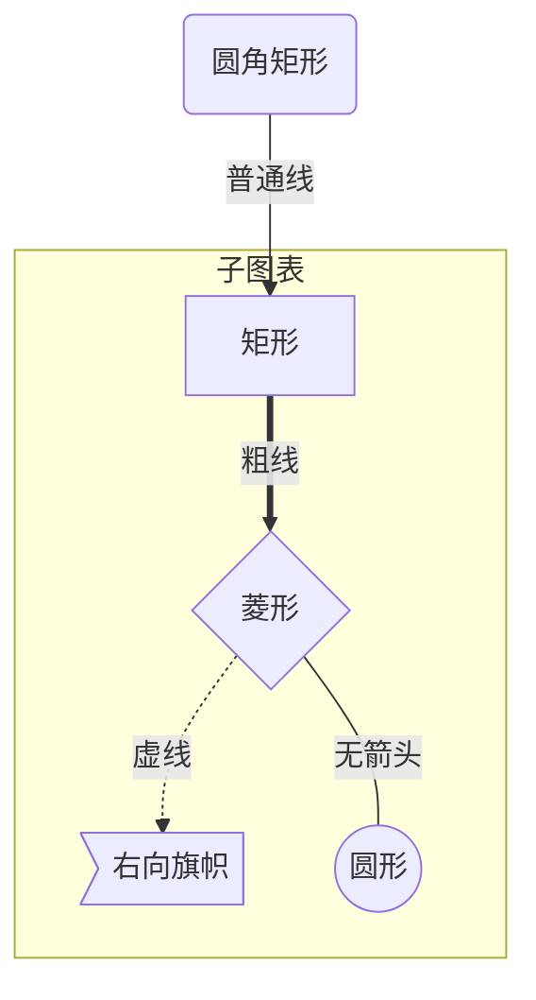

---

## 语义化的好处

* 易修改和维护
* 无障碍阅读支持
* 有利于SEO
* 面向未来的HTML

```mermaid
graph TB
    id1(圆角矩形)--普通线-->id2[矩形]
    subgraph 子图表
        id2==粗线==>id3{菱形}
        id3-.虚线.->id4>右向旗帜]
        id3--无箭头---id5((圆形))
    end
```