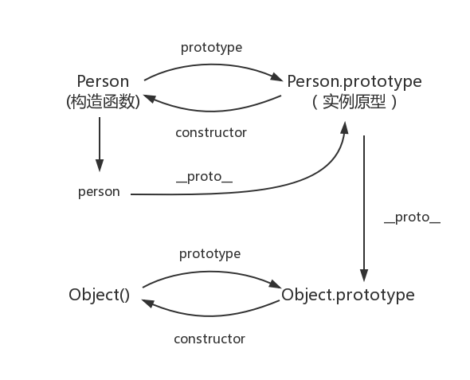

js是面向对象语言，有着自己的一套实现面向对象开发的机制。
## js创建对象的方式
```javascript
    let obj = {
        a: '1
    }

    let obj1 = new Object()
    obj1.a = '1'

    let obj2 = Object.create({})
    obj2.a = '1'

    // 构造函数
    function A(a) {
        this.a = a
    }

    let obj3 = new A('1')


```
## 原型和原型链
### 函数的原型
每个函数都有一个prototype属性，prototype有一个constructor属性，该属性指向该函数造函数
### 对象的原型
对象在创建时，都会关联一个原型对象，可以通过对象.__proto__取得。当用构造函数创建对象时，__proto__指向构造函数的prototype。原型，对象，构造函数的关系可以由下图表示：


### 原型的原型
变量与作用域
上面说了，原型也是一个对象，该对象有自己的__proto__属性，指向一个原型对象，构造函数的原型的原型是由Object函数创建出来，它指向Object的prototype。而构造函数的原型的原型则指向null。

## 原型链
将上面的关系全部综合起来，可以得到下面的关系图



## js的继承实现
>组合继承


```javascript
function Parent(name) {
    this.name = name
}

Parent.prototype.getName = function() {
    return this.name
}

function Child(name,age) {
    Parent.call(this, name)
    this.age = age
}

Child.prototype = new Parent() // 继承原型

Child.prototype.constructor = Child // 改变constructor指向，指向子类构造函数

```

> 寄生组合继承

```javascript
function Parent (name) {
    this.name = name
}

Parent.prototype.sayName = function() {
    console.log(this.name)
}

function Child(name, age) {
    Parent.call(this, name)
    this.age = age
}

function inherit(child, Parent) {
    let o = Object.create(Parent.prototype) // 以父类原型复制一个对象

    child.prototype = o  // 子类原型指向这个对象

    o.constructor = child // 赋值构造函数，子类原型指向子类构造函数

}

inherit(Child, Parent)

let child = new Child('zs', 14)
child.sayName() // zs
````
寄生组合继承，是以父类原型创建一个对象，（不能直接指向父类的原型对象，因为这会影响父类。）并让该对象的constructor属性指向子类构造函数，子类构造函数的prototype再指向
该对象，实现了对父类原型的继承。在子类构造函数内部，再调用父类构造函数增加实例属性，以此实现继承。

该方法解决了组合继承父类构造函数被调用两次的问题。

> ES6的继承实现

主要利用了寄生组合继承的实现原理